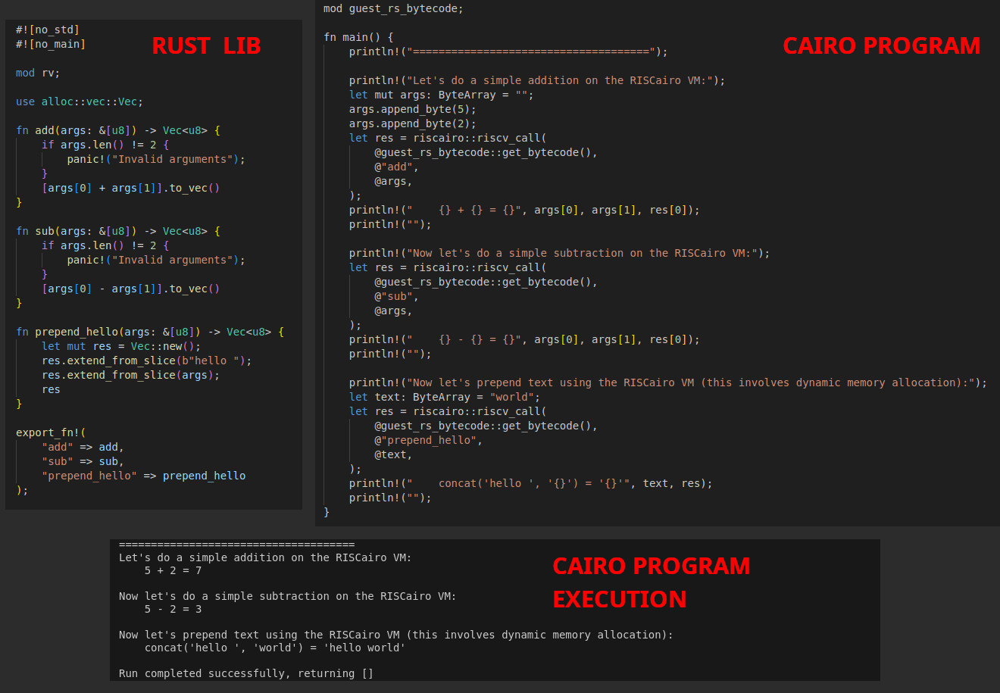

# `riscairo` project template

This repo contains a sample library written in Rust (`guest_rs`) that exposes a couple of functions including "compute_hash" that are then called from a starknet contract (`host_cairo`).

When you compile the `guest_rs`, make sure to use a tool like the provided `convert.py` to inline the ELF file into a `.cairo` source file within the `host_cairo` source.

To try it on on a contract already deployed on sepolia, use `try_me.py`.

This is part of the `riscairo` project (https://github.com/massalabs/riscairo).

